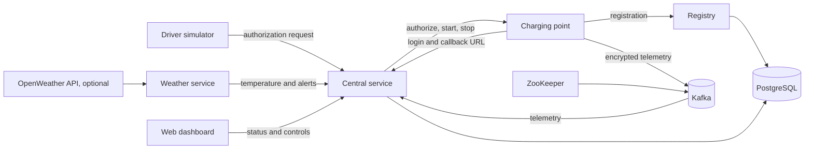

# Distributed EV Charging Platform

A local simulation of an electric vehicle charging network, based on the final `sd_pract2` implementation. It began as a two-person Distributed Systems project at the University of Alicante. Vicente led and implemented most of the system.

Python services register a charging point, coordinate driver requests, send encrypted telemetry through Kafka, store records in PostgreSQL, update weather conditions, and provide a web dashboard.

## Architecture



- **Registry (`ev_registry`)** registers charging points, issues tokens, and stores their records.
- **Central service (`ev_central`)** manages charging point sessions, driver authorization, dashboard controls, tickets, audit logs, weather alerts, and Kafka telemetry.
- **Charging point (`ev_cp`)** registers as `MADRID-01` by default, receives central service callbacks, simulates charging, and publishes encrypted telemetry.
- **Driver (`ev_driver`)** makes simulated authorization requests.
- **Weather (`ev_weather`)** polls active locations and sends temperatures and low temperature alerts. It uses simulated values when no OpenWeather key is set.
- **Dashboard (`ev_front`)** shows charging point status, weather, tickets, and controls through the central service.

PostgreSQL stores charging points, tickets, and audit logs. Kafka carries charging telemetry; ZooKeeper supports the Kafka broker. The central service also keeps active sessions and current weather in memory.

## Run locally

You need Docker and the Compose plugin. From the repository root:

```bash
cp .env.example .env
# Set a unique local DB_PASSWORD in .env
docker compose up --build
```

On Windows PowerShell, copy the example with `Copy-Item .env.example .env`. Open [http://localhost:5000](http://localhost:5000) after startup. The Compose file starts one charging point (`MADRID-01`) and a driver simulator automatically. Allow time for the database, Kafka, registration, and login to become ready; the charging point retries registration and login. Driver requests authorize a connection; starting and stopping a charge are separate dashboard actions.

For one manual driver request, use:

```bash
docker compose run --rm ev_driver python app.py --user Alice --cp MADRID-01
```

That command waits for Ctrl+C after a successful request and then asks the central service to disconnect. To stop the stack, run `docker compose down`. To reset its database, run `docker compose down -v`, which discards local simulation data.

The dashboard, central API, registry, Kafka, and PostgreSQL are bound to `127.0.0.1` on the host. No private LAN address is needed for this Compose workflow.

## Manual multi-point workflow

The original `sd_pract2` workflow started charging points and drivers in separate terminals. The public Compose file starts one default point and an automatic driver for a quick demonstration. You can still run additional points and drivers manually while the base services are up.

For a controlled demonstration, stop the automatic driver first:

```bash
docker compose stop ev_driver
```

In a new terminal, start a second point. Keep this terminal open:

```bash
docker compose run --rm --no-deps --name ev-cp-sevilla -e CP_CALLBACK_HOST=ev-cp-sevilla ev_cp python app.py --id SEVILLA-03 --city Sevilla --price 0.45
```

The container name and `CP_CALLBACK_HOST` must match so the central service sends commands to this point, rather than to the default `ev_cp`. Give every additional point a unique container name and `--id`. The point registers itself, stores its location, and logs in automatically. Its city then appears on the dashboard and in the weather service's location list.

In another terminal, simulate a driver requesting that point:

```bash
docker compose run --rm --no-deps ev_driver python app.py --user Ana --cp SEVILLA-03
```

The request authorizes a connection. Use the dashboard at [http://localhost:5000](http://localhost:5000) to start and stop charging and inspect the ticket. The manual driver waits for Ctrl+C to disconnect.

The weather service normally polls registered cities automatically. To force one temperature without it being overwritten by the next poll:

```bash
docker compose stop ev_weather
docker compose run --rm --no-deps ev_weather python app.py --city Sevilla --temp 18
```

A temperature below 0 °C sends a low temperature alert and may stop charging. Run `docker compose start ev_weather` to resume automatic updates. These commands use Docker's internal network, so they do not require a private LAN address or host-side Python setup.

## Configuration

`.env.example` contains placeholders only. Set `DB_PASSWORD` in your ignored local `.env`. `OPENWEATHER_API_KEY` is optional; leave it empty to generate simulated temperatures. With a key, failed provider requests do not generate substitute readings. Do not reuse a key that has previously been exposed.

Charging point tokens are generated during registration. Local `token_*.json` files, `.env`, local databases, Python caches, and virtual environments are ignored by Git. The container demo does not preserve its generated token across a fresh charging point container; resetting only the container while retaining the database may require a database reset or re-registration.

Run `docker compose config --quiet` after setting `DB_PASSWORD` to validate the Compose configuration.

## Repository structure

| Path | Role |
| --- | --- |
| `docker-compose.yml` | Local service topology |
| `db/init.sql` | PostgreSQL schema |
| `ev_common/` | Shared configuration |
| `ev_registry/`, `ev_central/` | Registration and coordination APIs |
| `ev_cp/`, `ev_driver/` | Charging point and driver simulators |
| `ev_weather/` | Weather polling and alerts |
| `ev_front/` | Flask dashboard |
| `tests/` | Focused weather behavior tests |

## Scope and limitations

This is a local educational simulation with one charging point in the default Compose setup. Startup depends on several services becoming ready, and the Kafka consumer has limited recovery if the broker is unavailable at its initial connection. Active sessions and weather state are held in memory. The HTTP APIs and local database configuration are intended for development and should not be exposed to the internet.
