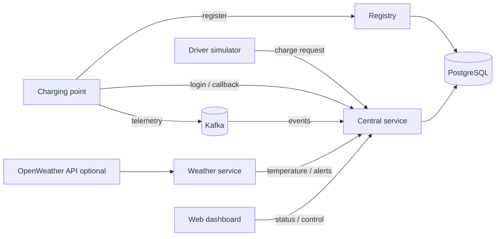

# Distributed EV Charging Platform

A Docker Compose simulation of a small electric-vehicle charging network. Python services register a charging point, coordinate charging requests, publish telemetry through Kafka, store state in PostgreSQL, process weather updates, and expose a local web dashboard.

This began as a University of Alicante distributed-systems project. The project was originally developed in October–November 2025, but it has recently been updated to address security vulnerabilities and released for professional use, ensuring it is easy for all users to understand.

## Architecture



**Components:** `ev_registry` issues charging-point registration tokens and stores station records; `ev_central` handles sessions, requests, tickets, audit records and telemetry consumption; `ev_cp` simulates one charging point; `ev_driver` generates charge requests; `ev_weather` reports temperatures; `ev_front` serves the dashboard. Kafka and ZooKeeper transport telemetry, and PostgreSQL stores persistent state.

## Run locally

Install Docker with the Compose plugin. From the repository root:

```bash
cp .env.example .env
# Edit .env and set a unique local DB_PASSWORD.
docker compose up --build
```

On Windows PowerShell, use `Copy-Item .env.example .env` for the first command. Open [http://localhost:5000](http://localhost:5000) after the services have started. The driver simulator runs automatically and may need a short time for the charging point to register. You can also issue a manual request:

```bash
docker compose run --rm ev_driver python app.py --user Alice --cp MADRID-01
```

Stop the stack with `docker compose down`. To start with a fresh database, run `docker compose down -v` only if you intend to discard local simulation data.

The Compose stack binds the dashboard, central API, registry, Kafka and PostgreSQL ports to `127.0.0.1`. No private LAN address is needed. The default demo starts one charging point (`MADRID-01`) and a driver simulator. It is a local educational simulation, not a production service.

## Configuration

Copy `.env.example` to `.env`; `.env` is ignored by Git. `DB_PASSWORD` is required for the local PostgreSQL database. `OPENWEATHER_API_KEY` is optional: without it, the weather service generates simulated temperatures for a self-contained demo. Set a new provider key only in your local `.env` if you want live weather. Do not reuse any key that appeared in the earlier public repository. Charging-point tokens are generated at registration and local `token_*.json` files are ignored by Git.

The services read Docker service names (`db`, `kafka`, `ev_central`, `ev_registry`) on the Compose network. Port constants and database settings are in `ev_common/config.py`. `docker compose config --quiet` checks the configuration before starting the stack.

## Project layout

| Path | Purpose |
| --- | --- |
| `docker-compose.yml` | Local service topology |
| `db/init.sql` | PostgreSQL schema |
| `ev_common/` | Shared configuration |
| `ev_registry/`, `ev_central/` | Registration and coordination APIs |
| `ev_cp/`, `ev_driver/` | Charging-point and driver simulators |
| `ev_weather/` | Weather polling and alert simulation |
| `ev_front/` | Flask dashboard and template |
| `tests/` | Focused checks |

## Design and limits

The services communicate through HTTP for commands and Kafka for telemetry. The registry and central service share PostgreSQL for station and ticket state. The weather integration has a simulated mode so the project can be explored without an external account. The web dashboard is an inspection and control surface for the local demo.

This code is intended for learning and demonstration. It has one default charging point, simple startup ordering, and limited recovery from service failures. The local HTTP APIs and database setup are not hardened for internet exposure. Weather values are simulated when no API key is configured. No performance or scale claim is implied by the architecture.

## Licensing

MIT
